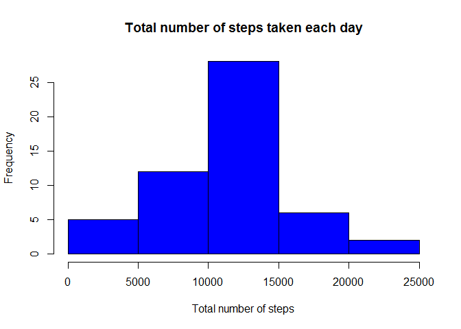
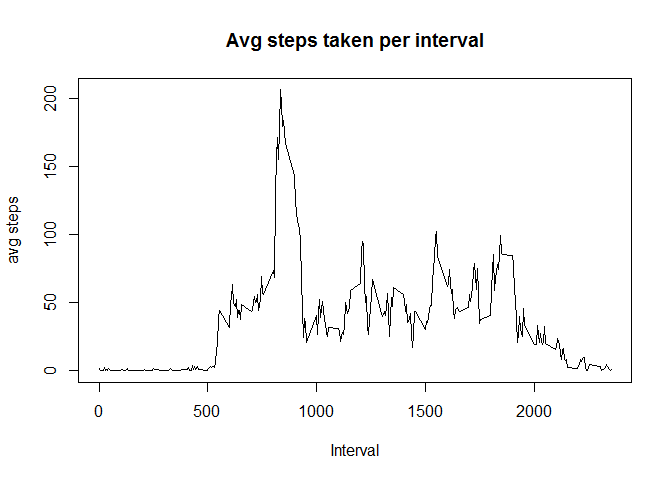
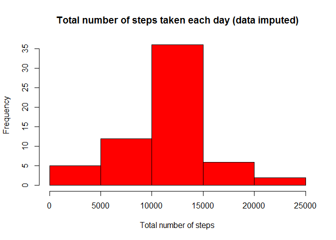
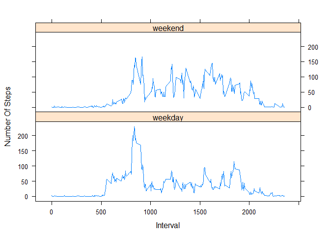

# Reproducible Research: Peer Assessment 1


## Loading and preprocessing the data

File is unzipped.  
The data is read using read.csv  
The sqldf library is used to manipulate the data (throughout the code).  


```r
library(sqldf)
```

```
## Loading required package: gsubfn
## Loading required package: proto
## Loading required package: RSQLite
## Loading required package: DBI
## Loading required package: RSQLite.extfuns
```

```r
library(lattice)
unzip("activity.zip")
data <- read.csv("activity.csv")
data_per_day <- sqldf("select date,sum(steps) total_steps 
                      from data 
                      where steps is not null 
                      group by date")
```

```
## Loading required package: tcltk
```


## What is mean total number of steps taken per day?


```r
hist(data_per_day$total_steps,xlab="Total number of steps",main="Total number of steps taken each day", col="blue")
```

 

```r
mean_val <- mean(data_per_day$total_steps)
mean_val
```

```
## [1] 10766.19
```

```r
median_val <- median(data_per_day$total_steps)
median_val
```

```
## [1] 10765
```

The mean of total steps taken each day is 10766.19.  
The median of total steps taken each day is 10765. 

## What is the average daily activity pattern?
1. Calculating for each interval - the average of steps taken, accross all days.
2. Plotting a time series of the intervals (x) and the avg of steps taken (y).
3. Finding the interval with the maximum average number of steps. 

```r
avg_steps_per_interval <- sqldf("select interval, avg(steps) avg_steps 
                                from data  
                                group by interval")
plot(avg_steps_per_interval$interval, avg_steps_per_interval$avg_steps, type="l",
     xlab="Interval",ylab="avg steps",main="Avg steps taken per interval")
```

 

```r
max_val <- sqldf("select interval, avg_steps from avg_steps_per_interval where avg_steps = (select max(avg_steps) from avg_steps_per_interval)")

max_val
```

```
##   interval avg_steps
## 1      835  206.1698
```
The 5 minute interval with the maximum average steps taken is interval # 835. The average steps taken in this interval is 206.17.    


## Imputing missing values

```r
null_cnt <- sqldf("select count(*) from data where steps is null")
null_cnt
```

```
##   count(*)
## 1     2304
```

The number of 5-mintue intervals with NA values is 2304  


The strategy for filling all NA values is the avg of steps for that 5-minute interval across all days.  
If a NA (null) value is detected, the avg_steps value of the same interval is used (from the calculations done in the previous section - part 3)


```r
data_imputed <- sqldf("select 
                    case when steps is null then avg_steps else steps end i_steps , 
                    date, data.interval, avg_steps 
                  from data , avg_steps_per_interval 
                  where data.interval = avg_steps_per_interval.interval")


data_per_day_imputed <- 
  sqldf("select date,sum(i_steps) total_steps 
        from data_imputed 
        group by date")

hist(data_per_day_imputed$total_steps,xlab="Total number of steps",main="Total number of steps taken each day (data imputed)", col="red")
```

 

```r
mean_i <- mean(data_per_day_imputed$total_steps)
mean_i
```

```
## [1] 10766.19
```

```r
median_i <- median(data_per_day_imputed$total_steps)
median_i
```

```
## [1] 10766.19
```

The mean of total steps taken each day (after filling NA values) is 10766.19.  
The median of total steps taken each day (after filling NA values) is 10766.19. 

The mean has not changed. 
The median has changed, and is now equal to the mean.

## Are there differences in activity patterns between weekdays and weekends?

Calculating the average steps for each interval - seperated to weekday and weekend intervals.  
Then, Plotting the time series of weekday days and weekend days.

```r
data_imputed$date_type <- sapply(weekdays(as.Date(data_imputed$date)),switch,
                                 Monday='weekday',
                                 Tuesday='weekday',
                                 Wednesday='weekday',
                                 Thursday='weekday',
                                 Friday='weekday',
                                 Saturday='weekend',
                                 Sunday='weekend')
data_imputed_avg <- sqldf("select interval, date_type, avg(i_steps) avg_steps
                          from data_imputed 
                          group by interval, date_type")
par(mfrow=c(2,1))

xyplot(data_imputed_avg$avg_steps~data_imputed_avg$interval | data_imputed_avg$date_type, type="l",layout=c(1,2),xlab="Interval",ylab="Number Of Steps")
```

 
